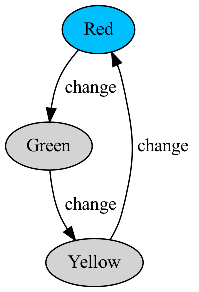

I’ve been reading a
[book](https://www.amazon.com/Principles-Model-Checking-MIT-Press/dp/026202649X/ref=sr_1_1?crid=2RGC1B0N79HIJ&keywords=principles+of+model+checking&qid=1651762001&sprefix=principles+of+model+checking%2Caps%2C134&sr=8-1)
and watching a [lecture
series](https://www.youtube.com/watch?v=Y5Hg4MvUXc4&list=PLwabKnOFhE38C0o6z_bhlF_uOUlblDTjh)
about model checking. This is a topic I’ve learned a bit about in the
past, but never really studied in earnest.

In model checking, we create a *model* of some sort of stateful
artifact, like a computer program, sequential circuit, or even something
in the “real world” (like a vending machine or traffic light). Then, we
state a *property* we would like to hold about *all possible behaviors*
of the model. Finally, we check whether this property holds for the
model, using a variety of nifty algorithms.

This series of blog posts constitutes a brief and very high-level
introduction to model checking, using Haskell code to express the ideas
and implement the algorithms. The intended audience is anyone who knows
a bit of Haskell, and who wants to understand what model checking is all
about.

This post was generated with `pandoc` from a [literate haskell
document](https://github.com/benjaminselfridge/model-checking/blob/master/src/ModelChecking1.lhs).

Overview
========

``` haskell
module ModelChecking1 where

import Data.List (find)
import System.Random (RandomGen, randomR)
```

In this post, we will introduce transition systems, and we will state
simple properties about them, called *invariants*. We will also
implement a simple model checking algorithm, whose aim is to check that
an invariant holds for all reachable states of the system.

Transition systems
==================

A *transition system* over state set `s`, action set `action`, and
atomic propositions `ap` is defined as follows:

``` haskell
data TransitionSystem s action ap = TransitionSystem
  { tsInitialStates :: [s]
  , tsLabel         :: s -> [ap]
  , tsTransitions   :: s -> [(action, s)]
  }
```

The intuition behind each of the three fields of a transition system
`ts` is as follows:

-   `tsInitialStates ts`: “the states that the system can start in”
-   `tsLabel ts s`: “the set of all atomic propositions that are true in
    state `s`”
-   `tsTransitions ts s`: “all of `s`’s outgoing transitions”

The label of a state is an abstraction of the “internal data” of that
state, and the transitions are an abstraction of control flow. Here, a
transition is a pair `(action, s')` where `s'` is the destination state
of the transition, and `action` is a name for the transition.

Example: Traffic light
----------------------

<figure>
<figcaption aria-hidden="true">Transition system for a traffic light</figcaption>
</figure>

We can create a very simple transition system representing the states
and transitions of a traffic light. The states `s` will be the colors
red, yellow, and green:

``` haskell
data Color = Red | Yellow | Green deriving (Show, Eq, Ord)
```

There will only be one action:

``` haskell
data Change = Change deriving (Show, Eq, Ord)
```

Our set of transitions will allow `Red` to transition to `Green`,
`Green` to `Yellow`, and `Yellow` to `Red`:

``` haskell
traffic_light :: TransitionSystem Color Change Color
traffic_light = TransitionSystem
  { tsInitialStates = [Red]
  , tsLabel = \s -> [s]
  , tsTransitions = \s -> case s of
      Red    -> [(Change, Green )]
      Green  -> [(Change, Yellow)]
      Yellow -> [(Change, Red   )]
  }
```

Notice that we reuse our state type `Color` as our set of atomic
propositions. The label of each state `s` is `[s]`: the only color that
is “true” in state `s` is `s` itself.

Running a transition system
---------------------------

A *run* of a transition system is a finite or infinite path in the
underlying graph:

``` haskell
data Path s action = Path { pathHead :: s, pathTail :: [(action, s)] }
  deriving (Show)
```

In the transitions systems we’ll define, it will be useful to be able to
examine random infinite runs of the system to get a feel for what the
possibilites are:

``` haskell
randomRun :: RandomGen g => g -> TransitionSystem s action ap -> Path s action
randomRun g ts = let (i, g') = randomR (0, length (tsInitialStates ts) - 1) g
                     s = tsInitialStates ts !! i
                 in Path s (loop g' s ts)
  where loop g s ts = let nexts = tsTransitions ts s
                          (i, g') = randomR (0, length nexts - 1) g
                          (action, s') = nexts !! i
                      in (action, s') : loop g' s' ts
```

Let’s generate a random run of our `traffic_light` example in `ghci`:

``` haskell
  > import System.Random
  > g = mkStdGen 0
  > r = randomRun g traffic_light
  > pathHead r
  Red
  > take 6 (pathTail r)
  [(Change,Green),(Change,Yellow),(Change,Red),(Change,Green),(Change,Yellow),(Change,Red)]
```

Because each state in `traffic_light` has exactly one outgoing
transition, this is the only run we will ever get. In subsequent posts,
we’ll look at nondeterministic transition systems which will return
different runs with different random generators.

The following functions will be useful:

``` haskell
singletonPath :: s -> Path s action
singletonPath s = Path s []
```

``` haskell
consPath :: (s, action) -> Path s action -> Path s action
consPath (s, action) (Path s' tl) = Path s ((action, s'):tl)
```

``` haskell
reversePath :: Path s action -> Path s action
reversePath (Path s prefix) = go [] s prefix
  where go suffix s [] = Path s suffix
        go suffix s ((action, s'):prefix) = go ((action, s):suffix) s' prefix
```

Propositions
============

We are interested in checking properties about the possible runs of a
transition system. For this, we will need the notion of a *proposition*:

``` haskell
type Proposition ap = [ap] -> Bool
```

In this context, the list `[ap]` is thought of as “the set of atomic
propositions that are true”.

A very simple example of a proposition is `true`, which holds for all
inputs:

``` haskell
true :: Proposition ap
true _ = True
```

Similarly, `false` holds for no inputs:

``` haskell
false :: Proposition ap
false _ = False
```

Given an atomic propositional variable `ap`, we can form the proposition
“`ap` holds” as follows:

``` haskell
atom :: Eq ap => ap -> Proposition ap
atom ap aps = ap `elem` aps
```

We can “lift” the usual boolean operators to work with propositions:

``` haskell
(.&) :: Proposition ap -> Proposition ap -> Proposition ap
(p .& q) aps = p aps && q aps
infixr 3 .&

(.|) :: Proposition ap -> Proposition ap -> Proposition ap
(p .| q) aps = p aps || q aps
infixr 2 .|

pnot :: Proposition ap -> Proposition ap
pnot p aps = not (p aps)

(.->) :: Proposition ap -> Proposition ap -> Proposition ap
(p .-> q) aps = if p aps then q aps else True
infixr 1 .->
```

Checking invariants
===================

Given a transition system `ts` and a proposition `p`, we can ask: “Does
`p` hold at all reachable states in `ts`?” A proposition which is
supposed to hold at all reachable states of a transition system is
called an *invariant*.

To check whether an invariant holds, we evaluate the proposition on each
reachable state (more precisely, on the *label* of each reachable
state). To do this, we first define a lazy depth-first search.

Depth-first search
------------------

Our search algorithm produces each reachable state, along with the path
traversed to reach that state.

``` haskell
dfs :: Eq s => [s] -> (s -> [(action, s)]) -> [(s, Path s action)]
dfs starts transitions = (\p@(Path s tl) -> (s, reversePath p)) <$> loop [] (singletonPath <$> starts)
  where loop visited stack = case stack of
          [] -> []
          ((Path s _):stack') | s `elem` visited -> loop visited stack'
          (p@(Path s _):stack') ->
            let nexts = [ consPath (s', action) p | (action, s') <- transitions s ]
            in p : loop (s:visited) (nexts ++ stack')
```

The `checkInvariant` function
-----------------------------

Now, to check an invariant, we simply collect all the reachable states
via `dfs` and make sure the invariant holds for each of their labels,
producing a path to a bad state if there is one:

``` haskell
checkInvariant :: Eq s
               => Proposition ap
               -> TransitionSystem s action ap
               -> Maybe (s, Path s action)
checkInvariant p ts =
  let rs = dfs (tsInitialStates ts) (tsTransitions ts)
  in find (\(s,_) -> pnot p (tsLabel ts s)) rs
```

Checking a traffic light invariant
----------------------------------

Let’s check an invariant of our traffic light system – that the light is
never red and green at the same time. It’s not a very interesting
invariant, but it’s a good one for any traffic light to have.

We can use our `checkInvariant` function to check that this invariant
holds:

``` haskell
  > checkInvariant (pnot (atom Red .& atom Green)) traffic_light
  Nothing
```

The result `Nothing` means there were no counterexamples, which means
our invariant holds! Let’s try it with an invariant that doesn’t hold:

``` haskell
  > checkInvariant (pnot (atom Yellow)) traffic_light
  Just (Yellow,Path {pathHead = Red, pathTail = [(Change,Green),(Change,Yellow)]})
```

Our invariant checking algorithm was able to find a path to a state that
violated `pnot (atom Yellow)`; unsurprisingly, the bad state was
`Yellow` (the last state in the counterexample path). Because `Yellow`
is reachable in our transition system, this property doesn’t hold. What
if, however, `Yellow` is not reachable?

``` haskell
  > traffic_light = TransitionSystem [Red] (:[]) (\s -> case s of Red -> [(Change, Green)]; Green -> [(Change, Red)]; Yellow -> [(Change, Red)])
  > checkInvariant (pnot (atom Yellow)) traffic_light
  Nothing
```

Conclusion
==========

Hopefully, this first post gave you a taste of what model checking is
all about. In the next post, we’ll talk about how to convert
higher-level programs into transition systems, we’ll explore some more
interesting examples.
